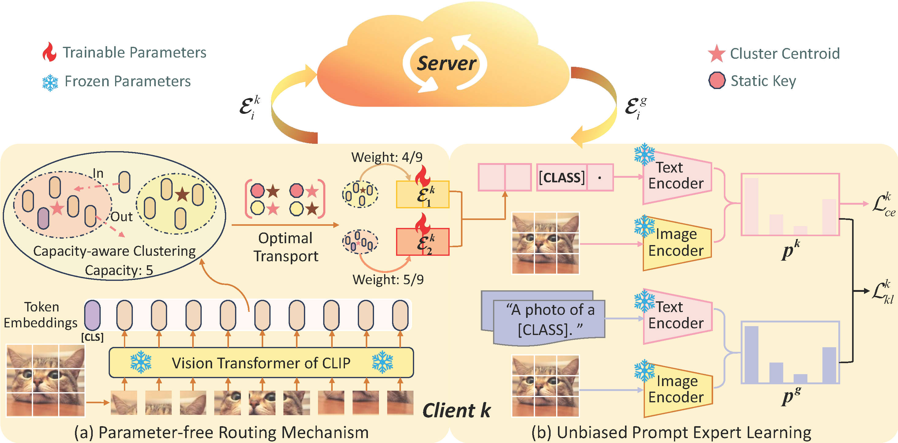

# Parameter-Free Token-Level Prompt Mixture for Federated Domain Generalization

This project implements our paper.



**Abstract:** Federated domain generalization (FedDG) aims to learn a globally generalizable model from decentralized clients with heterogeneous data while preserving privacy. Recent studies have introduced prompt learning to adapt vision-language models (VLMs) in FedDG by learning a single global prompt. However,
such a one-prompt-fits-all learning paradigm typically leads to performance degradation on personalized samples. Although the mixture of experts (MoE) offers a promising solution for specialization, existing MoE-based methods suffer from coarse image-level expert assignment and high communication costs from parameterized routers. To address these limitations, we propose TRIP, a Token-level pRompt mIxture with Parameter-free routing framework for FedDG, which treats multiple prompts as distinct experts. Unlike existing image-level routing designs, TRIP assigns different tokens within an image to specific experts. To ensure communication efficiency, TRIP incorporates a parameter-free routing mechanism based on token clustering and optimal transport. The instance-specific prompt is then synthesized by aggregating experts, weighted by the number of tokens assigned to each. Additionally, TRIP develops an unbiased
learning strategy for prompt experts, leveraging the VLM’s zeroshot generalization capability. Extensive experiments across four benchmarks demonstrate that TRIP achieves optimal generalization results, with communicating only 1K parameters per round.  

## Requirement

The required packages are listed in `requirements.txt` for minimum requirement (Python 3.8.5):

```
$ pip install ftfy regex tqdm
$ pip install git+https://github.com/openai/CLIP.git
$ pip install -r requirements.txt
$ pip install torch==1.10.1+cu111 torchvision==0.11.2+cu111 torchaudio==0.10.1 -f https://download.pytorch.org/whl/cu111/torch_stable.html
```

## Dataset

## Datasets

[
PACS](https://wjdcloud.blob.core.windows.net/dataset/PACS.zip).

[VLCS](https://wjdcloud.blob.core.windows.net/dataset/VLCS/VLCS.zip).

[Office-Home](https://wjdcloud.blob.core.windows.net/dataset/OfficeHome.zip)

[DomainNet](https://ai.bu.edu/M3SDA/)  (Download the **cleaned** version of split files  for DomainNet dataset.)

## Results on Office-Home

| Methods              | Art          | Clipart      | Product      | Real         | Average      | Com.cost      |
| -------------------- | ------------ | ------------ | ------------ | ------------ | ------------ | ------------- |
| FedCLIP              | 78.45        | 64.77        | 87.68        | 87.84        | 79.69        | 0.524M        |
| PromptFL             | 80.75        | 69.88        | 90.96        | 90.25        | 82.96        | 0.008M        |
| FedOTP               | 81.16        | 70.23        | 90.98        | 90.82        | 83.30        | 0.008M        |
| FedAPT               | 82.96        | <u>70.98</u> | 91.33        | 90.51        | 83.94        | 0.534M        |
| **TRIP-Lite (Ours)** | <u>84.21</u> | 70.19        | <u>92.34</u> | <u>91.41</u> | <u>84.53</u> | **0.001M**    |
| **TRIP (Ours)**      | **85.49**    | **71.22**    | **92.97**    | **91.79**    | **85.37**    | <u>0.065M</u> |

## How to run

Before running the training script, you should generate the  weights for prompt  experts  using the code in /utils/generate_weights_multi.py.

We also provided the weights in  weight_dir.

We provide the commands  in Office-Home to reproduce the results.

```shell
bash tarin.sh
```

## Results

**PACS**

| Backbone | AlexNet |         |  CLIP  |         |           |
| -------- | :-----: | :-----: | :----: | :-----: | :-------: |
| Methods  | FedAVG  | FedProx | FedAVG | FedProx |   Ours    |
| A        |  60.93  |  59.89  | 64.65  |  77.81  | **95.15** |
| C        |  57.99  |  58.88  |  84.5  |  87.95  | **95.36** |
| P        |  59.68  |  59.41  | 87.87  |  89.42  | **95.46** |
| S        |  56.14  |  55.89  | 89.16  |  90.08  | **94.99** |
| AVG      |  58.69  |  58.52  | 81.55  |  86.32  | **95.24** |

## Contact

- gsh8210@163.com
- crcui@sdufe.edu.cn  

## References

```

```

